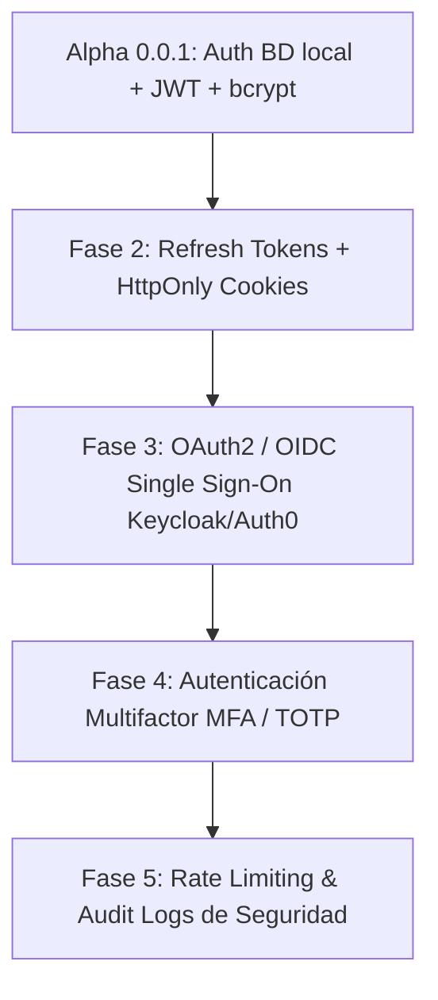

# Documentación de Seguridad, Usuarios y Claves: Versión Alpha 0.0.1

Este documento establece el registro oficial de credenciales iniciales, arquitectura de seguridad, restricciones por rol y hoja de ruta para la evolución de la autenticación en la plataforma **CRM Automotora ERP**.

---

## 1. Tabla Oficial de Usuarios y Claves Iniciales

En esta primera instancia de la versión **Alpha 0.0.1**, los usuarios y contraseñas son gestionados a través de la base de datos centralizada con el dominio oficial `@origen.cl`.

| Nombre Completo | Correo Electrónico | Contraseña Inicial | Rol Asignado | Alcance y Permisos |
| :--- | :--- | :--- | :--- | :--- |
| **Carlos Mendoza** | `admin@origen.cl` | `Admin123!` | `ADMIN` | **Acceso Total**: Administración del sistema, gestión de cuentas, usuarios y configuración global. |
| **Roberto Gómez** | `gerente@origen.cl` | `Gerente123!` | `GERENTE` | **Gestión Comercial**: KPIs, inventario, cotizaciones, aprobación de financiamiento y reportes. |
| **Matías Silva** | `vendedor1@origen.cl` | `Vendedor123!` | `VENDEDOR` | **Ventas**: Inventario, gestión de leads asignados y generación de cotizaciones. |
| **Camila Torres** | `vendedor2@origen.cl` | `Vendedor123!` | `VENDEDOR` | **Ventas**: Inventario, gestión de leads asignados y generación de cotizaciones. |
| **Felipe Reyes** | `fi@origen.cl` | `Fi123!` | `F_AND_I` | **Financiamiento & Seguros**: Evaluación y aprobación de solicitudes de crédito automotriz. |
| **Valentina Morales** | `bdc@origen.cl` | `Bdc123!` | `BDC` | **Recepción & Prospectos**: Calificación y derivación de leads entrantes (llamadas/web). |

> [!IMPORTANT]
> **Restricción de Seguridad Exclusiva de Administración**
> El módulo de **Gestión de Cuentas y Creación de Usuarios** está restringido exclusivamente para la cuenta con rol `ADMIN` (`admin@origen.cl`). Ningún otro rol (`GERENTE`, `VENDEDOR`, `F_AND_I`, `BDC`) posee facultades para acceder o crear cuentas de usuario.

---

## 2. Arquitectura de Seguridad Actual (Fase 1 - BD & JWT)

La plataforma utiliza los siguientes estándares en su estado inicial Alpha 0.0.1:

1. **Almacenamiento de Contraseñas (Hashing)**:
   - Se utiliza el algoritmo **`bcrypt`** con salting aleatorio. Las contraseñas en texto plano **nunca** se almacenan ni registran en disco.
   - Endpoint de verificación de credenciales: `POST /api/security/test-credentials`.

2. **Autenticación y Sesiones (JWT)**:
   - Firma de tokens con clave secreta y algoritmo **`HS256`**.
   - Los tokens expiran en un plazo de **24 horas** y contienen las declaraciones (`claims`) de usuario `sub` (email) y `rol`.
   - Endpoint de autenticación: `POST /api/auth/login`.

3. **Control de Acceso Basado en Roles (RBAC)**:
   - Verificación de permisos en FastAPI mediante inyección de dependencias `Depends(require_roles([...]))`.
   - Si un usuario intenta acceder a un recurso no autorizado, la API retorna inmediatamente una respuesta **`HTTP 403 Forbidden`**.

---

## 3. Hoja de Ruta para Autenticación Robusta Futura (Fase Enterprise)

El sistema ha sido estructurado modularmente para permitir la transición fluida hacia un esquema de seguridad de clase empresarial:

### Componentes Diseñados para Integración Futura:
- **OAuth2 / OIDC Providers**: Habilitación de inicio de sesión único (SSO) con proveedores externos (Google Workspace, Keycloak, Microsoft Entra ID).
- **Autenticación Multifactor (MFA/TOTP)**: Implementación de códigos de verificación temporales mediante aplicaciones como Google Authenticator o Authy.
- **Refresh Tokens & Cookies HttpOnly**: Almacenamiento seguro de tokens de refresco en cookies del navegador con directivas `HttpOnly` y `SameSite=Strict`.
- **Rate Limiting & Anti-Brute Force**: Protección contra ataques de fuerza bruta utilizando `slowapi` y Redis.
- **Audit Trail & Revocación de Sesiones**: Registro inmutable de eventos de seguridad (inicios de sesión, cambios de contraseña y revocación remota de tokens).

---

## 4. Registro de Cambios y Procedimiento Realizado (Release Alpha 0.0.1)

A continuación se detalla el conjunto de tareas completadas para la liberación oficial del release **Alpha 0.0.1**:

1. **Limpieza de Datos de Muestra (Sample Data)**:
   - Se eliminaron todos los registros de prueba de vehículos, clientes, leads de ventas, cotizaciones, solicitudes F&I y prospectos BDC en la base de datos (`seed.py`).
   - El estado inicial de la base de datos y de las pantallas del frontend arranca completamente **limpio** (0 filas de muestra operacionales).

2. **Creación del Módulo de Seguridad y Pruebas de Roles**:
   - **Frontend**: Componente `SecuritySection.jsx` que incluye probador de credenciales bcrypt, evaluador interactivo de matriz de roles (RBAC), directorio de usuarios de BD (protegido solo para ADMIN) y hoja de ruta visual.
   - **Backend**: Router `security.py` registrado en `main.py` con los endpoints `/api/security/users`, `/api/security/test-credentials`, `/api/security/test-role` y `/api/security/create-user`.

3. **Estandarización del Dominio de Correo (`@origen.cl`)**:
   - Todas las cuentas de usuario de sistema fueron migradas al dominio oficial `@origen.cl`.

4. **Verificación Automatizada**:
   - Pruebas unitarias y de integración ejecutadas con `pytest` alcanzando un 100% de aprobación (`4 passed`).

5. **Guardado en GitHub**:
   - Los cambios han sido empaquetados en un commit oficial etiquetado para el release Alpha 0.0.1 y sincronizados en la rama principal `origin/main`.
