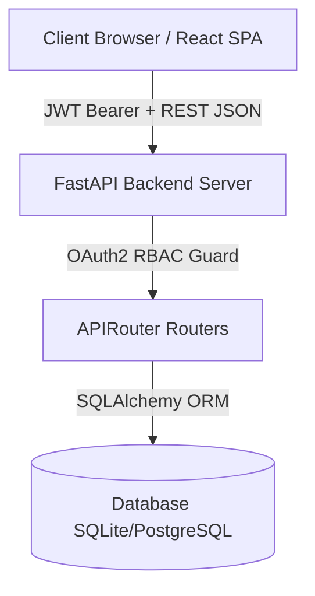

# 🏗️ Arquitectura del Sistema

El sistema utiliza una arquitectura desvinculada (Decoupled SPA + REST API) con soporte **Multi-Tenant** mediante aislamiento por columna `tenant_id`.



---

## 🏢 Soporte Multi-Tenant

Cada modelo en la base de datos posee un campo `tenant_id`:

```python
class Vehicle(Base):
    __tablename__ = "vehiculos"
    id = Column(String, primary_key=True)
    tenant_id = Column(String, ForeignKey("tenants.id"), nullable=True)
    patente = Column(String, unique=True)
    ...
```

Esto permite que múltiples automotoras compartan la misma infraestructura manteniendo una separación lógica absoluta de sus inventarios, leads y cotizaciones.
